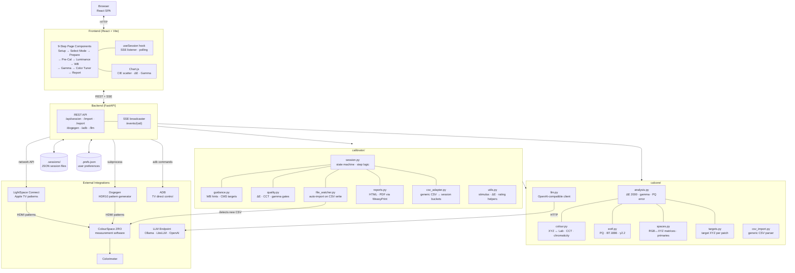

# Calibration Helper

**A guided, step-by-step TV calibration assistant built around ColourSpace ZRO.**

Calibration Helper walks you through a full display calibration — from baseline grayscale to white balance, gamma, and color management — importing your ZRO measurements automatically and telling you exactly what to turn and by how much at every step. When you're done, it generates a polished PDF report showing before/after results.

---

## What It Does

Professional TV calibration involves a dozen distinct measurement phases, hundreds of adjustments, and a lot of back-and-forth between your measurement software and your TV's service menu. Calibration Helper replaces the spreadsheets and mental bookkeeping with a structured web app that:

- **Guides you through each phase in order** — Pre-Grayscale → Luminance → White Balance → Gamma → Color Tuner → Post-Grayscale → Report
- **Imports measurements automatically** — point it at your ColourSpace ZRO export folder and it picks up every CSV the moment ZRO writes it
- **Computes exactly what to adjust** — for white balance, it tells you which Gain/Offset knob to move and by how much; for the color tuner it targets hue, saturation, and brightness per primary
- **Tracks quality gates** — flags when ΔE, CCT, or gamma are out of acceptable range so you know when a phase is done vs. when to keep adjusting
- **Exports a full PDF report** — stat cards, pre/post ΔE charts, gamma curve, and measurement tables in a single shareable document

It supports two hardware paths out of the box — **Dogegen** (PC-based HDR10 pattern generator) and **LightSpace Connect** (Apple TV) — and can drive some TVs directly over ADB.

---

## Screenshots

> Run the app, open [http://localhost:8000](http://localhost:8000), and create a session to see the full workflow.

---

## Architecture



---

## Calibration Workflow

Each session moves through nine sequential steps. You can jump back to any completed step by clicking it in the progress bar.

| Step | What Happens |
|---|---|
| **Select Mode** | Choose SDR, HDR10, or Dolby Vision. Sets the target EOTF, color gamut, and peak luminance. |
| **Prepare** | TV-specific checklist: picture mode to select, settings to reset, service menu notes. Pattern generator and measurement settings configured here. |
| **Pre-Grayscale** | Baseline 0–100% gray ramp. Establishes your starting ΔE and gamma before any adjustments. |
| **Luminance** | Set black level, white clipping, and peak brightness. Guided by a luminance quality gate. |
| **White Balance** | Two-point white balance using 80% (Gain) and 30% (Offset) patches. Gives you per-channel adjustment directions. |
| **Gamma** | Quick (4-point) or fine (21-point) gamma tracking. Shows effective gamma deviation from target at each stimulus step. |
| **Color Tuner** | CMS adjustments for all six primaries and secondaries (Red, Green, Blue, Cyan, Magenta, Yellow). |
| **Post-Grayscale** | Verification ramp after all adjustments. Compares to the pre-cal baseline. |
| **Report** | Full calibration summary with improvement percentage, downloadable as PDF or HTML. |

---

## Requirements

### Software

- **Python 3.11+**
- **ColourSpace ZRO** or **ColourSpace Zero** (measurement software) — [LightIllusion](https://www.lightillusion.com/)
- A modern browser (Chrome or Edge recommended)

### Hardware

One of the following pattern generator setups:

| Generator | Description |
|---|---|
| **Dogegen** | PC application that generates HDR10 test patterns over HDMI. Recommended for HDR10 calibration on Windows. |
| **LightSpace Connect** | Apple TV app that sends patches from ColourSpace. Free tier supports up to 25 patches; paid tier is unlimited. |

A colorimeter or spectrophotometer supported by ColourSpace ZRO (i1Display, Colorimetry Research, Klein K10-A, etc.).

---

## Installation

### 1. Clone the Repository

```bash
git clone https://github.com/jweber93/tv-calibration.git
cd tv-calibration
```

### 2. Create a Virtual Environment

```bash
python -m venv .venv

# Windows
.venv\Scripts\activate

# macOS / Linux
source .venv/bin/activate
```

### 3. Install Dependencies

```bash
pip install --upgrade pip
pip install -r requirements.txt
```

> **WeasyPrint on Windows** — PDF export uses WeasyPrint 60+, which bundles its own rendering libraries and does not require a separate GTK install. `pip install weasyprint` is sufficient.

### 4. Start the Server

```bash
uvicorn server:app --host 0.0.0.0 --port 8000
```

Open **[http://localhost:8000](http://localhost:8000)** in your browser.

The server can also be bound to `localhost` only if you don't need LAN access:

```bash
uvicorn server:app --port 8000
```

---

## Docker

The repository ships with a `Dockerfile` and `docker-compose.yml` that run the FastAPI backend, LiteLLM proxy, and a Samba share (for ZRO CSV auto-import from Windows) as a single composed stack.

A pre-built image is published to GitHub Container Registry on every push to `main` and every version tag:

```
ghcr.io/jweber93/tv-calibration:latest
ghcr.io/jweber93/tv-calibration:v1.2.3   # tagged releases
```

### Docker Compose (recommended)

```bash
git clone https://github.com/jweber93/tv-calibration.git
cd tv-calibration

# Optional: supply your OpenRouter key to enable cloud LLM routing
export OPENROUTER_API_KEY=sk-or-...

docker compose up -d
```

Open **[http://localhost:8000](http://localhost:8000)** in your browser.

**Services:**

| Service | Port(s) | Description |
|---|---|---|
| `calcore-server` | 8000 | FastAPI backend + web UI |
| `litellm` | 4000 | LiteLLM routing proxy (AI assistant) |
| `samba` | 139, 445 | Network share exposing the ZRO drop folder to Windows |

**Persistent volumes:**

| Volume | Container path | Contents |
|---|---|---|
| `calcore-data` | `/app/data` | Sessions, calibration history, preferences |
| `calcore-zro` | `/data/zro-drops` | ZRO CSV auto-import drop folder |

**Connecting ColourSpace ZRO (Windows):**

Map a network drive to `\\<host-ip>\zro-drops` (user: `zro`, password: `zro`). In ColourSpace ZRO, set the export folder to that drive. On the app's Prepare page, set the Watch Folder to `/app/data/zro-drops` — new CSVs will be picked up automatically the moment ZRO writes them.

**AI assistant:**

If you have an OpenRouter API key, set it before running `docker compose up`:

```bash
export OPENROUTER_API_KEY=sk-or-...
docker compose up -d
```

Then in the AI Assistant section on the Prepare page, set the endpoint to `http://localhost:4000` and model to `tvcal-analyst`. The LiteLLM proxy routes to Claude Sonnet via OpenRouter and falls back to a local Ollama instance if the cloud is unavailable.

### Standalone container (no LiteLLM or Samba)

Pull the published image or build locally:

```bash
# Pull from GHCR (no build required)
docker pull ghcr.io/jweber93/tv-calibration:latest

docker run -d --name tv-cal \
  -p 8000:8000 \
  -v calcore-data:/app/data \
  -e LITELLM_ENDPOINT= \
  -e LITELLM_MODEL= \
  ghcr.io/jweber93/tv-calibration:latest

# Or build locally from source
docker build -t tv-calibration/calcore-server:latest .
docker run -d --name tv-cal \
  -p 8000:8000 \
  -v calcore-data:/app/data \
  tv-calibration/calcore-server:latest
```

AI features require a separately-reachable LLM endpoint; set `LITELLM_ENDPOINT` and `LITELLM_MODEL` when you have one.

### Environment variables

| Variable | Default | Description |
|---|---|---|
| `LITELLM_ENDPOINT` | *(empty)* | URL of the LiteLLM proxy or any OpenAI-compatible endpoint |
| `LITELLM_MODEL` | *(empty)* | Model name to send in chat completion requests |
| `ZRO_BRIDGE_URL` | *(empty)* | URL of the ZRO Bridge for triggered measurements |
| `DOGEGEN_PATH` | *(empty)* | Path to the Dogegen executable inside the container |
| `OPENROUTER_API_KEY` | *(empty)* | OpenRouter API key (read by the LiteLLM service) |
| `TZ` | `UTC` | Timezone for the Samba sidecar |

---

## Unraid

An Unraid container template (`unraid-template.xml`) is included in the repository and registered at its `<TemplateURL>`, so it will appear in **Community Applications** automatically.

The image is published to `ghcr.io/jweber93/tv-calibration:latest` — no local build required.

### Install on Unraid via Community Applications

Search for **tv-calibration** in the Community Applications plugin and click Install. The template pre-fills all paths; you only need to set the **ZRO Drops Share** path to match your ColourSpace export directory.

### Manual install on Unraid

1. In the Unraid web UI go to **Docker → Add Container** and fill in:

   | Field | Value |
   |---|---|
   | **Name** | `tv-calibration` |
   | **Repository** | `ghcr.io/jweber93/tv-calibration:latest` |
   | **Network type** | Bridge |
   | **Port** | `8000 → 8000 (TCP)` |

3. Add the following path mappings:

   | Container path | Host path | Required |
   |---|---|---|
   | `/data/zro-drops` | e.g. `/mnt/user/downloads/zro-drops` | Yes — ZRO CSV drop folder |
   | `/app/.sessions` | `/mnt/user/appdata/tv-calibration/.sessions` | Recommended |
   | `/app/.calibration-history` | `/mnt/user/appdata/tv-calibration/.calibration-history` | Recommended |
   | `/app/.prefs.json` | `/mnt/user/appdata/tv-calibration/.prefs.json` | Recommended |
   | `/app/tools/dogegen` | path to Dogegen on host | Optional |

4. Click **Apply**. Open `http://<UNRAID_IP>:8000` in your browser.

**ZRO watch folder on Unraid:**

Expose the `/mnt/user/downloads/zro-drops` directory as an Unraid SMB share (User Shares → Add Share, or enable an existing share). On your Windows machine, map that share as a network drive and point ColourSpace ZRO's export folder to it. The app's Watch Folder on the Prepare page should match the container path (`/data/zro-drops`).

**AI assistant on Unraid:**

Run the LiteLLM proxy as a separate Unraid container (`ghcr.io/anthropic/litellm:latest`) with the `litellm_config.yaml` from the repo mounted at `/app/litellm_config.yaml`. Set the `LITELLM_ENDPOINT` variable in the tv-calibration container to `http://<UNRAID_IP>:4000`.

---

## Quick Start

1. **Start the server** and open [http://localhost:8000](http://localhost:8000)
2. **Create a session** — enter your TV model name and select a mode (SDR, HDR10, or Dolby Vision)
3. **Work through Prepare** — select your pattern generator, configure measurement settings, and follow the TV checklist
4. **Start the Watch Folder** — point it at your ColourSpace export directory so measurements import automatically
5. **Measure and advance** — each step tells you what to measure in ColourSpace; once the CSV lands, the app imports it and evaluates your results
6. **Follow the guidance** — at White Balance and Color Tuner steps, the app calculates adjustments and tells you what to change
7. **Finish at Report** — download your PDF

---

## Feature Details

### Automatic CSV Import

The Watch Folder monitors a directory for new ColourSpace ZRO `.csv` files. When ZRO finishes a measurement sequence and writes the file, the app detects it within seconds and imports it into the active session step — no manual upload required.

You can also drag-and-drop a CSV onto the upload zone or use the **Measure** button with the ZRO Bridge to trigger a measurement from within the app.

Configure the watch path on the Prepare page. The path persists across sessions.

### ZRO Bridge

The ZRO Bridge lets ColourSpace ZRO trigger a measurement from within the app workflow. Set up a post-measurement webhook in ZRO pointing to `http://localhost:7070/measure` and the app's **Measure** button will fire ZRO's next patch sequence on click.

The Bridge status indicator in the header bar shows whether the connection is live (green) or unreachable (red).

> **Note — Remote Control backend:** The `tools/zro-bridge/backends/remote_control_backend.py` stub is **experimental and not ready for use**. The Light Illusion Integration Protocol format has not been obtained, so `trigger_measurement()` always returns an error. The webhook path (above) is the working integration method.

### Dogegen Integration

When Dogegen is selected as the pattern generator, the app manages the Dogegen process directly:

- Starts and stops Dogegen automatically when you enter and leave measurement steps
- Configures the recommended settings for HDR10: ST2084 Rec.2020, 10 bpc, RGB 4:4:4 Full, 10% window
- Shows a status indicator in the header bar (green when running and ready)

Configure the Dogegen executable path and signal settings in the **Dogegen Companion** card on the Prepare page.

### LightSpace Connect

When LightSpace Connect is selected, the app configures the grayscale ramp based on your tier:

- **Free tier** — up to 25 patches; supports 11-step and 21-step ramps
- **Paid tier** — unlimited patches; supports up to 51-step ramps

### AI Assistant (Optional)

Connect any OpenAI-compatible LLM endpoint (Ollama, LiteLLM, OpenAI, Claude via OpenRouter) to receive plain-English calibration coaching after each measurement import.

The assistant system has four integrated capabilities:

| Capability | What It Does |
|---|---|
| **Step guidance** | After each CSV import, the LLM receives a compact measurement summary (scalar ΔE, gamma, PQ error) and the worst-offender patches, then returns one actionable calibration step. |
| **Display memory** | Prior sessions for this TV model are injected into every prompt as a compressed history block (up to 3 sessions + baseline). The LLM can detect drift, thermal aging, and repeat known compromises. |
| **Gamut expert** | `POST /api/session/{sid}/gamut/advise` runs a deterministic gamut feasibility check per primary, then asks the LLM to explain trade-offs in plain English when a primary is outside the ADB CMS correction range. |
| **Patch strategy** | After each import the LLM also recommends which patches to add or skip next (`patch_strategy` SSE event). Strategies with confidence ≥ 0.6 are flagged for auto-apply; lower-confidence ones surface for user review. |
| **Predictive patch density** | `GET /api/session/{sid}/suggested-patches` analyzes per-patch ΔE residuals and returns an optimized patch list — denser where error is highest, sparser where results are within tolerance. Capped at a configurable budget (default 30). |
| **Delta summary** | `POST /api/report/compare/delta_summary` compares two sessions and asks the LLM to write a plain-English paragraph describing what improved, what regressed, and likely causes. |

Configure under the **AI Assistant** section on the Prepare page. All AI features are non-blocking — the workflow runs fully without an LLM endpoint configured.

The **Test Connection** button on the Prepare page calls `probe_llm()` to verify that the configured endpoint is reachable and returns a valid chat response before any measurement is triggered. Errors from the LLM (HTTP errors, malformed JSON, timeouts) are logged to the server log stream and surfaced in the UI without interrupting the calibration flow.

#### Recommended Local Models (Ollama)

If you prefer to run entirely offline or want a free fallback, [Ollama](https://ollama.com) is the easiest path on Windows. All models below expose an OpenAI-compatible endpoint at `http://localhost:11434` — set the AI Assistant endpoint to that URL and pick the model name from the table.

Two of the four AI tasks (`patch_strategy`, `remediation`) require the model to return strict JSON with no surrounding text. JSON reliability is therefore the deciding factor, more so than raw reasoning quality.

| Model | VRAM | JSON reliability | Notes |
|---|---|---|---|
| **`qwen2.5:14b`** | ~9 GB | Excellent | **Top recommendation.** Best JSON discipline among 7–14B local models; already the Ollama fallback in `litellm_config.yaml`. Use this if your GPU has ≥10 GB VRAM. |
| **`qwen2.5:7b`** | ~5 GB | Very good | Best choice for 8 GB cards. Nearly as reliable as the 14B for the short prompts this app sends. |
| **`phi4:14b`** | ~9 GB | Very good | Microsoft's Phi-4; strong structured-output discipline. Comparable to Qwen 2.5 14B, slightly slower on most hardware. |
| **`llama3.1:8b`** | ~5 GB | Good | Meta's Llama 3.1 8B Instruct. Wider community support; occasional JSON fence leakage (handled by the strip logic in `llm.py`). |
| **`mistral:7b-instruct`** | ~5 GB | Good | Fast inference, lower memory pressure. Adequate for step guidance; less consistent on the patch-strategy JSON schema. |

**Quick start with Ollama:**

```bash
# Install Ollama from https://ollama.com, then:
ollama pull qwen2.5:14b
ollama serve          # starts the server on port 11434
```

In the AI Assistant section on the Prepare page, set:
- **Endpoint:** `http://localhost:11434`
- **Model:** `qwen2.5:14b` (or whichever model you pulled)

No API key is required for Ollama.

---

#### LiteLLM Proxy (Recommended)

For model-agnostic routing, response caching, and offline fallback, run the bundled LiteLLM proxy:

```bash
pip install "litellm[proxy]"
litellm --config litellm_config.yaml --port 4000
```

Then set the AI Assistant endpoint to `http://localhost:4000` and model to `tvcal-analyst`.

The proxy routes to Claude Sonnet via OpenRouter by default and falls back to a local Ollama model if the cloud provider is unavailable. Response caching avoids redundant API calls when re-running the LLM on unchanged measurements.

See `litellm_config.yaml` for available models and configuration options.

### ADB TV Control

For supported TVs, the app can apply color management settings directly over Android Debug Bridge without navigating service menus:

- Push CMS values (hue, saturation, brightness per channel) to the TV's DEX interface
- Read and set picture mode, brightness, contrast, and saturation
- Deploy adjustments from the Color Tuner step with a single button click

ADB must be installed and your TV must have ADB debugging enabled over the network. The ADB status card appears on measurement steps when a compatible device is detected.

### Server Logs Panel

A live server log stream is available in the UI for debugging. The panel tails the FastAPI process log in real time via `GET /api/logs/stream` (SSE). Log entries include CSV import events, LLM trigger attempts, Dogegen process lifecycle, and any server-side errors. The panel is collapsed by default; expand it from the header bar.

### Before/After Delta Report

Compare any two calibration sessions side-by-side to quantify the impact of adjustments over time — useful for comparing SDR vs. HDR10, pre-treatment vs. post-treatment, or any two arbitrary sessions.

**API:**

```
GET  /api/report/compare?a={session_id}&b={session_id}           → JSON delta payload
GET  /api/report/compare?a={session_id}&b={session_id}&format=html → side-by-side HTML
GET  /api/report/compare?a={session_id}&b={session_id}&format=pdf  → printable PDF
POST /api/report/compare/delta_summary?a={id}&b={id}             → LLM prose paragraph
```

The delta payload includes per-metric differences (Δ Pre-Cal ΔE, Δ Post-Cal ΔE, Δ WB ΔE, Δ CMS ΔE, Δ Gamma, Δ Improvement %, Δ Peak Luminance) plus a `tv_mismatch` and `mode_mismatch` flag when sessions aren't directly comparable.

The optional LLM delta summary endpoint asks the configured AI assistant to write a plain-English paragraph explaining what improved, what regressed, and why.

**CLI:**

```bash
python cli.py compare session_a.json session_b.json
python cli.py compare session_a.json session_b.json \
  --llm-endpoint http://localhost:4000 --llm-model tvcal-analyst
```

Accepts either saved session JSON files or history-entry JSON files from `.calibration-history/`.

### Predictive Patch Density

Instead of a fixed measurement grid, the AI assistant can analyze current ΔE and gamma residuals and recommend a custom next-round patch set: denser sampling where error is highest, sparser where results are already within tolerance.

**API:**

```
GET  /api/session/{sid}/suggested-patches?budget=30
POST /api/session/{sid}/suggested-patches/run
```

`GET suggested-patches` returns a `PatchOptimization` object:

```json
{
  "patches": [
    {
      "nits": 80.0, "r": 200, "g": 200, "b": 200,
      "priority": "high",
      "label": "Gray 78%",
      "rationale": "ΔE 4.2 at this stimulus — add finer interpolation steps"
    }
  ],
  "rationale": "Dense sampling added in 60–85% range where gamma deviates > 0.15",
  "confidence": 0.82,
  "auto_apply": true,
  "patch_count": 12
}
```

Patches with `auto_apply: true` (confidence ≥ 0.7) can be forwarded directly to the ZRO Bridge via `POST suggested-patches/run`, which sends them to `{bridge_url}/measure/sequence` for immediate measurement.

The patch count is capped by the `budget` query parameter (default 30, maximum 200).

### PDF and HTML Reports

The Report page offers three export formats:

- **Download PDF** — a paginated PDF with stat cards, measurement tables, and session metadata. Generated server-side via WeasyPrint.
- **Open Full HTML Report** — the same content as an interactive browser page, suitable for sharing or archiving.
- **Download JSON** — the raw report data for use in external tools or scripts.

---

## TV Profiles

TV profiles define the recommended picture mode, reset values, service menu paths, and control ranges for a specific TV model. The app ships with profiles for:

| TV | Modes |
|---|---|
| Hisense U8G | SDR, HDR10, Dolby Vision |
| TCL 6-Series (7105X) | SDR, HDR10 |
| LG OLED55B7A (B7, 2017) | SDR, HDR10, Dolby Vision |
| Vizio V-Series (V4K55M) | SDR, HDR10 |

**Adding a profile** — profiles are defined in `calibrator/profiles.py`. Each profile is a Python dataclass specifying the TV name, supported modes, picture mode name, menu navigation paths, and a list of settings to reset, disable, and configure before calibration.

If your TV isn't listed, you can still use the app by creating a session with any TV name — the guidance steps will still run; only the TV-specific checklist content will be absent.

---

## Measurement Settings

| Setting | Options | Notes |
|---|---|---|
| **Grayscale Ramp** | 11-step, 21-step, 51-step | 51-step requires LightSpace Connect paid tier |
| **Signal Range** | Auto, Full (0–255 / 0–1023), Limited (16–235 / 64–940) | Auto snaps each code value to the nearest 5% stimulus level and infers the range; override if the auto-detection is wrong |
| **Patch Code Scale** | 8-bit, 10-bit | Use 10-bit for Dogegen HDR10 workflows |

These are configured on the Prepare page and persist for the session. The Measurement Settings section collapses to show a one-line summary (e.g., *21-step · Full Range · 10-bit*) after setup.

---

## Command-Line Interface

For batch analysis without the web UI:

```bash
python cli.py --csv /path/to/measurements.csv
```

Options:

| Flag | Description |
|---|---|
| `--mode sdr\|hdr` | Calibration mode |
| `--eotf pq\|gamma22\|bt1886\|<value>` | Target EOTF |
| `--target-space bt709\|p3d65\|bt2020` | Target color gamut |
| `--watch` | Watch for new CSV files and re-analyze on change |

### Comparing Sessions (CLI)

Compare two saved session or report JSON files from the command line:

```bash
python cli.py compare before.json after.json
python cli.py compare before.json after.json \
  --llm-endpoint http://localhost:4000 --llm-model tvcal-analyst
```

Accepts session report JSON files (exported via `GET /api/session/{sid}/report`) or `.calibration-history/{tv_key}/sessions.jsonl` entries. When an LLM endpoint is configured, appends a plain-English analysis paragraph below the delta table.

---

## Project Structure

```
calibrator/
  session.py          Session state machine and step logic
  profiles.py         TV model profile definitions (including LLM schema per model)
  guidance.py         Adjustment computation (WB, gamma, CMS)
  history.py          Per-display calibration history store (sessions.jsonl)
  quality.py          Quality gate thresholds and evaluation
  zro_import.py       ColourSpace ZRO CSV parser and classifier
  csv_adapter.py      Generic CSV → session bucket mapper (grayscale vs. color)
  file_watcher.py     Watch folder / auto-import
  adb_control.py      Android Debug Bridge integration
  reports.py          HTML and PDF report rendering
  models.py           Report dataclasses
  utils.py            Stimulus % conversion, ΔE helpers, rating labels
  runtime.py          Startup dependency checks and Rich console instance

calcore/
  models.py           Measurement, CalibrationTarget, Patch dataclasses
  analysis.py         ΔE 2000, gamma, PQ EOTF calculations
  colour.py           CIE conversions, CCT, primary chromaticities
  spaces.py           RGB↔XYZ matrices and primary chromaticities (BT.709, P3-D65, BT.2020)
  targets.py          Target XYZ computation per patch (grayscale + color primaries)
  csv_import.py       Generic ColourSpace CSV parser (header and headerless formats)
  gamut.py            Per-primary gamut feasibility check (PrimaryConstraint, GamutDiagnosis)
  patch_planner.py    Predictive patch density planning (SuggestedPatch, PatchOptimization)
  phase.py            Calibration phase determination logic
  llm.py              LLM client — guidance, history injection, patch strategy, remediation,
                      delta summary, patch optimization

server.py             FastAPI application (REST + SSE)
cli.py                Command-line batch analysis entry point
litellm_config.yaml   LiteLLM proxy config (model routing, caching, offline fallback)
Dockerfile            Container image for calcore-server (Python 3.12 + WeasyPrint)
docker-compose.yml    Composed stack: calcore-server + LiteLLM proxy + Samba share
unraid-template.xml   Unraid Community Applications container template
frontend/             React + Vite source (built output in static/)
static/               Pre-built frontend assets served by FastAPI
tests/                API, unit, and integration tests
tools/                Reference CSV sequences for ZRO workflows

.prefs.json           Persisted user preferences — watch path, LLM endpoint, Dogegen
                      config, ZRO bridge URL. Auto-created; gitignored. Written
                      atomically on every UI change; loaded at server startup.

.calibration-history/ Per-TV session history (auto-created; gitignored)
  {tv_key}/
    sessions.jsonl    One JSON line per completed calibration
    baseline.json     First-ever calibration reference
```

---

## Development

### Running the Frontend Dev Server

```bash
cd frontend
npm install
npm run dev
```

The Vite dev server proxies API requests to `http://localhost:8000` and hot-reloads on file changes.

### Building the Frontend

```bash
cd frontend
npm run build
```

Output goes to `static/`, which the FastAPI server serves directly.

### Running Tests

```bash
pytest -q
```

Targeted test runs:

```bash
pytest -q tests/test_calcore        # Color math unit tests
pytest -q tests/test_server_api.py  # API integration tests
python -m compileall calcore calibrator server.py cli.py
```

---

## AI Integration Architecture

The AI system is structured as three tiers:

```
┌─────────────────────────────────────────────────────────┐
│                  tv-calibration server                  │
│                                                         │
│  CSV import (manual, watch-folder, or generic CSV)      │
│    → _calcore_analyze() → Summary                       │
│                    │                                    │
│                    ├─ scalar metrics (ΔE, gamma, PQ)    │
│                    ├─ top_offenders (worst 3 patches)   │  ← P0: prompt
│                    └─ PRE-COMPUTED guidance context     │     leakiness fix
│                                                         │
│  profiles.py → llm_schema (per TV model)                │  ← TV-specific
│    injected into prompt as control-range context        │     nomenclature
│                                                         │
│  calibrator/history.py                                  │
│    load_history(tv_key) → compressed history block      │  ← P1/P2: display
│                    │                                    │     memory
│                    ▼                                    │
│  calcore/llm.py                                         │
│    call_llm(summary, cfg, phase,                        │
│             history_block=...)        → step guidance   │  ← SSE: llm_insight
│    query_next_patch_strategy(...)     → patch sequence  │  ← SSE: patch_strategy
│    query_gamut_advice(diagnosis_text) → trade-off prose │  ← POST gamut/advise
│    query_remediation(event_type, ...) → recovery steps  │  ← POST hw/remediate
│                                                         │
│  calcore/gamut.py                                       │
│    assess_gamut_constraints(color_rows) → GamutDiagnosis│  ← P3: expert-in-loop
│    format_gamut_diagnosis() → text for LLM              │
└─────────────────────────────────────────────────────────┘
              │
              ▼ HTTP POST /v1/chat/completions
┌─────────────────────────────────────────────────────────┐
│           LiteLLM proxy  (localhost:4000)               │
│                                                         │
│  • Response cache (TTL 1h) — avoids duplicate API calls │
│  • Routes: OpenRouter → Claude / GPT-4o / local Ollama  │
│  • Fallback: cloud → local Ollama on network failure    │
└─────────────────────────────────────────────────────────┘
              │
              ▼
    Upstream model (Claude Sonnet / GPT-4o / Qwen local)
```

### AI Data Flow: What Gets Sent to the LLM

The LLM prompt contains **only pre-aggregated data** — no raw per-patch XYZ arrays:

| Data sent | Source | Why |
|---|---|---|
| `grayscale_avg_de`, `grayscale_max_de`, `grayscale_over_3` | Summary scalars | Trend judgment |
| `gamma_midtones`, `pq_err_midtones` | Summary scalars | EOTF diagnosis |
| `color_75/100_avg_de`, `color_75/100_chroma_avg` | Summary scalars | Gamut diagnosis |
| `top_offenders` (worst 3 patches, label + ΔE only) | Derived from rows | Actionable specifics |
| `DISPLAY HISTORY` block | `.calibration-history/` | Drift / aging context |
| `llm_schema` (control paths, ranges, menu terminology) | `profiles.py` per TV model | TV-specific adjustment guidance |
| Phase, mode, EOTF, target space | Session config | Framing |

**Not sent:** full `grayscale_rows`, full `color_rows` (raw XYZ triples). These exist in the `Summary` for UI rendering but are excluded from the LLM payload.

### API Endpoints Reference

| Method | Endpoint | Purpose |
|---|---|---|
| `GET` | `/api/session/{sid}/gamut/diagnosis` | Per-primary gamut constraint report (deterministic) |
| `POST` | `/api/session/{sid}/gamut/advise` | LLM trade-off advice for out-of-range primaries |
| `GET` | `/api/session/{sid}/history` | Calibration history for this TV model |
| `POST` | `/api/session/{sid}/hardware/remediate` | LLM-guided hardware fault recovery plan |
| `POST` | `/api/session/{sid}/import/generic` | Import any CSV (header or headerless; grayscale or color) |
| `GET` | `/api/prefs` | Read persisted user preferences |
| `POST` | `/api/prefs` | Write user preferences (watch path, LLM config, Dogegen, bridge URL) |
| `GET` | `/api/logs/stream` | SSE stream of server log lines (for the in-UI logs panel) |
| `GET` | `/api/report/compare?a={id}&b={id}` | JSON delta payload comparing two sessions |
| `GET` | `/api/report/compare?a={id}&b={id}&format=html` | Side-by-side HTML comparison report |
| `GET` | `/api/report/compare?a={id}&b={id}&format=pdf` | Printable PDF comparison report |
| `POST` | `/api/report/compare/delta_summary?a={id}&b={id}` | LLM-authored plain-English delta summary |
| `GET` | `/api/session/{sid}/suggested-patches?budget=30` | LLM-optimized patch list from residual analysis |
| `POST` | `/api/session/{sid}/suggested-patches/run` | Forward suggested patches to the ZRO Bridge |

SSE stream (`GET /api/session/{sid}/llm/stream`) now emits two event types:

| Event | Description |
|---|---|
| `llm_insight` | One-step calibration guidance (existing) |
| `patch_strategy` | Recommended patch additions/skips for next pass; `auto_apply: true` if confidence ≥ 0.6 |

---

## Glossary

| Term | Meaning |
|---|---|
| **ΔE (Delta E)** | Perceptual color difference. ΔE < 2 is invisible to most viewers; < 1 is considered excellent. |
| **CCT** | Correlated Color Temperature in Kelvin. The D65 standard white point is 6504 K. |
| **EOTF** | Electro-Optical Transfer Function — the curve that maps signal values to screen brightness. BT.1886 targets γ ≈ 2.40; PQ is used for HDR10. |
| **Grayscale Ramp** | A sweep of gray patches from 0% to 100% stimulus, used to evaluate gamma and white point tracking. |
| **Signal Range** | Whether patch codes use the full 0–255 (or 0–1023) range or the limited 16–235 (64–940) video range. |
| **CMS / Color Tuner** | Color Management System — per-primary adjustments for hue, saturation, and luminance of the six color primaries and secondaries. |
| **ZRO** | ColourSpace ZRO / Zero — the measurement software by LightIllusion that drives colorimeters and exports CSV data. |
| **Dogegen** | A Windows pattern generator application that sends HDR10 test patches over HDMI. |
| **LightSpace Connect** | An Apple TV app that pairs with ColourSpace to generate patches via an Apple TV connected to the display. |
